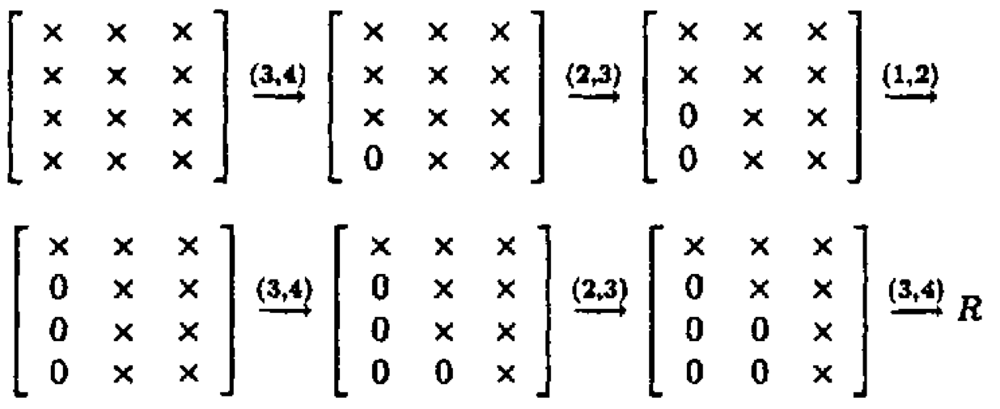

 <!-- Requires 'collapse-output' quarto package: https://github.com/mcanouil/quarto-collapse-output -->

```{r}
#| output-fold: true
#| jupyter: {outputs_hidden: true}
sessionInfo()
```


```{r}
#| output-fold: true
#| jupyter: {outputs_hidden: true}
library(Matrix)
```

## QR Decomposition

* We learned Cholesky decomposition as **one** approach for solving linear regression.

* Another approach for linear regression uses the QR decomposition.  
    **This is how the `lm()` function in R does linear regression.**

```{r}
#| output-fold: true
#| jupyter: {outputs_hidden: true}
set.seed(2020) # seed

n <- 5
p <- 3
(X <- matrix(rnorm(n * p), nrow=n)) # predictor matrix
(y <- rnorm(n))    # response vector

# find the (minimum L2 norm) least squares solution
lm(y ~ X - 1)
```

We want to understand what is QR and how it is used for solving least squares problem.

## Definitions

* Assume $\mathbf{X} \in \mathbb{R}^{n \times p}$ has full column rank. Necessarilly $n \ge p$.

* **Full QR decomposition**:  
$$
    \mathbf{X} = \mathbf{Q} \mathbf{R},  
$$
where  
    - $\mathbf{Q} \in \mathbb{R}^{n \times n}$, $\mathbf{Q}^T \mathbf{Q} = \mathbf{Q}\mathbf{Q}^T = \mathbf{I}_n$. In other words, $\mathbf{Q}$ is an orthogonal matrix.  
        - First $p$ columns of $\mathbf{Q}$ form an orthonormal basis of ${\cal R}(\mathbf{X})$ (**range** or column space of $\mathbf{X}$)      
        - Last $n-p$ columns of $\mathbf{Q}$ form an orthonormal basis of ${\cal N}(\mathbf{X}^T)$ (**null space** of $\mathbf{X}^T$)
        - Recall that $\mathcal{N}(\mathbf{X}^T)=\mathcal{R}(\mathbf{X})^{\perp}$ and $\mathcal{R}(\mathbf{X}) \oplus \mathcal{N}(\mathbf{X}^T) = \mathbb{R}^n$.
    - $\mathbf{R} \in \mathbb{R}^{n \times p}$  is upper triangular with positive diagonal entries. 
        - The lower $(n-p)\times p$ block of $\mathbf{R}$ is $\mathbf{0}$ (why?).

 * **Reduced QR decomposition**:
$$
    \mathbf{X} = \mathbf{Q}_1 \mathbf{R}_1,
$$
where
    - $\mathbf{Q}_1 \in \mathbb{R}^{n \times p}$, $\mathbf{Q}_1^T \mathbf{Q}_1 = \mathbf{I}_p$. In other words, $\mathbf{Q}_1$ is a partially orthogonal matrix. Note $\mathbf{Q}_1\mathbf{Q}_1^T \neq \mathbf{I}_n$.
    - $\mathbf{R}_1 \in \mathbb{R}^{p \times p}$  is an upper triangular matrix with positive diagonal entries.  

* Given QR decomposition $\mathbf{X} = \mathbf{Q} \mathbf{R}$,
    $$
    \mathbf{X}^T \mathbf{X} = \mathbf{R}^T \mathbf{Q}^T \mathbf{Q} \mathbf{R} = \mathbf{R}^T \mathbf{R} = \mathbf{R}_1^T \mathbf{R}_1.
    $$
    - Once we have a (reduced) QR decomposition of $\mathbf{X}$, we automatically have the Cholesky decomposition of the *Gram matrix*  $\mathbf{X}^T \mathbf{X}$.
    
### Least squares

* Normal equation
$$
    \mathbf{X}^T\mathbf{X}\beta = \mathbf{X}^T\mathbf{y}
$$
is equivalently written with reduced QR as
$$
    \mathbf{R}_1^T\mathbf{R}_1\beta = \mathbf{R}_1^T\mathbf{Q}_1^T\mathbf{y}
$$

* Since $\mathbf{R}_1$ is invertible, we only need to solve the triangluar system
$$
    \mathbf{R}_1\beta = \mathbf{Q}_1^T\mathbf{y}
$$
Multiplication $\mathbf{Q}_1^T \mathbf{y}$ is done implicitly (see below).

* This method is numerically more stable than directly solving the normal equation, since $\kappa(\mathbf{X}^T\mathbf{X}) = \kappa(\mathbf{X})^2$!

* In case we need standard errors, compute inverse of $\mathbf{R}_1^T \mathbf{R}_1$. This involves triangular solves.

## Gram-Schmidt procedure

* Wait! Does $\mathbf{X}$ always have a QR decomposition?
    - Yes. It is equivalent to the [Gram-Schmidt procedure](https://en.wikipedia.org/wiki/Gram–Schmidt_process) for basis orthonormalization.

* Assume $\mathbf{X} = [\mathbf{x}_1 | \dotsb | \mathbf{x}_p] \in \mathbb{R}^{n \times p}$ has full column rank. That is,  $\mathbf{x}_1,\ldots,\mathbf{x}_p$ are *linearly independent*.

* Gram-Schmidt (GS) procedure produces nested orthonormal basis vectors $\{\mathbf{q}_1, \dotsc, \mathbf{q}_p\}$ that spans $\mathcal{R}(\mathbf{X})$, i.e.,
$$
\begin{split}
    \text{span}(\{\mathbf{x}_1\}) &= \text{span}(\{\mathbf{q}_1\}) \\
    \text{span}(\{\mathbf{x}_1, \mathbf{x}_2\}) &= \text{span}(\{\mathbf{q}_1, \mathbf{q}_2\}) \\
    & \vdots \\
    \text{span}(\{\mathbf{x}_1, \mathbf{x}_2, \dotsc, \mathbf{x}_p\}) &= \text{span}(\{\mathbf{q}_1, \mathbf{q}_2, \dotsc, \mathbf{q}_p\}) 
\end{split}
$$
and $\langle \mathbf{q}_i, \mathbf{q}_j \rangle = \delta_{ij}$.

* The algorithm:
    0. Initialize $\mathbf{q}_1 = \mathbf{x}_1 / \|\mathbf{x}_1\|_2$
    0. For $k=2, \ldots, p$, 
$$
\begin{eqnarray*}
	\mathbf{v}_k &=& \mathbf{x}_k - P_{\text{span}(\{\mathbf{q}_1,\ldots,\mathbf{q}_{k-1}\})}(\mathbf{x}_k) = \mathbf{x}_k -  \sum_{j=1}^{k-1} \langle \mathbf{q}_j, \mathbf{x}_k \rangle \cdot \mathbf{q}_j \\
	\mathbf{q}_k &=& \mathbf{v}_k / \|\mathbf{v}_k\|_2
\end{eqnarray*}
$$

### GS conducts reduced QR

* $\mathbf{Q} = [\mathbf{q}_1 | \dotsb | \mathbf{q}_p]$. Obviously $\mathbf{Q}^T \mathbf{Q} = \mathbf{I}_p$.

* Where is $\mathbf{R}$? 
    - Let $r_{jk} = \langle \mathbf{q}_j, \mathbf{x}_k \rangle$ for $j < k$, and $r_{kk} = \|\mathbf{v}_k\|_2$.
    - Re-write the above expression:
$$
    r_{kk} \mathbf{q}_k = \mathbf{x}_k -  \sum_{j=1}^{k-1} r_{jk} \cdot \mathbf{q}_j
$$
        or
$$
    \mathbf{x}_k = r_{kk} \mathbf{q}_k +  \sum_{j=1}^{k-1} r_{jk} \cdot \mathbf{q}_j
    .
$$    
    - If we let $r_{jk} = 0$ for $j > k$, then $\mathbf{R}=(r_{jk})$ is upper triangular and
$$
    \mathbf{X} = \mathbf{Q}\mathbf{R}
    .
$$
 
 
  
Source: <https://dsc-spidal.github.io/harp/docs/harpdaal/algorithms/>  
  

### Classical Gram-Schmidt

```{r}
#| output-fold: true
#| jupyter: {outputs_hidden: true}
cgs <- function(X) {  # not in-place
    n <- dim(X)[1]
    p <- dim(X)[2]    
    Q <- Matrix(0, nrow=n, ncol=p, sparse=FALSE)
    R <- Matrix(0, nrow=p, ncol=p, sparse=FALSE)
    for (k in seq_len(p)) {
        Q[, k] <- X[, k]
        for (j in seq_len(k-1)) {
            R[j, k] = sum(Q[, j] * X[, k])  # dot product
            Q[, k] <- Q[, k] - R[j, k] * Q[, j]
        }
        R[k, k] <- Matrix::norm(Q[, k, drop=FALSE], "F")
        Q[, k] <- Q[, k] / R[k, k]
    }
    list(Q=Q, R=R)
}
```

* CGS is *unstable* (we lose orthogonality due to roundoff errors) when columns of $\mathbf{X}$ are almost collinear.

```{r}
#| output-fold: true
#| jupyter: {outputs_hidden: true}
e <- .Machine$double.eps
(A <- t(Matrix(c(1, 1, 1, e, 0, 0, 0, e, 0, 0, 0, e), nrow=3)))
```

```{r}
#| output-fold: true
#| jupyter: {outputs_hidden: true}
res <- cgs(A)
res$Q
```

```{r}
#| output-fold: true
#| jupyter: {outputs_hidden: true}
with(res, t(Q) %*% Q)
```

* `Q` is hardly orthogonal.
* Where exactly does the problem occur? (HW)

### Modified Gram-Schmidt

* The algorithm:
    0. Initialize $\mathbf{q}_1 = \mathbf{x}_1 / \|\mathbf{x}_1\|_2$
    0. For $k=2, \ldots, p$, 
$$
\begin{eqnarray*}
	\mathbf{v}_k &=& \mathbf{x}_k - P_{\text{span}(\{\mathbf{q}_1,\ldots,\mathbf{q}_{k-1}\})}(\mathbf{x}_k) = \mathbf{x}_k -  \sum_{j=1}^{k-1} \langle \mathbf{q}_j, \mathbf{x}_k \rangle \cdot \mathbf{q}_j \\
    &=&  \mathbf{x}_k -  \sum_{j=1}^{k-1} \left\langle \mathbf{q}_j, \mathbf{x}_k - \sum_{l=1}^{j-1}\langle \mathbf{q}_l, \mathbf{x}_k \rangle \mathbf{q}_l \right\rangle \cdot \mathbf{q}_j \\
	\mathbf{q}_k &=& \mathbf{v}_k / \|\mathbf{v}_k\|_2
\end{eqnarray*}
$$

```{r}
#| output-fold: true
#| jupyter: {outputs_hidden: true}
mgs <- function(X) { #  in-place
    n <- dim(X)[1]
    p <- dim(X)[2]
    R <- Matrix(0, nrow=p, ncol=p)
    for (k in seq_len(p)) {
        for (j in seq_len(k-1)) {
            R[j, k] <- sum(X[, j] * X[, k])  # dot product
            X[, k] <- X[, k] - R[j, k] * X[, j]
        }
        R[k, k] <- Matrix::norm(X[, k, drop=FALSE], "F")
        X[, k] <- X[, k] / R[k, k]
    }
    list(Q=X, R=R)
}
```

* $\mathbf{X}$ is overwritten by $\mathbf{Q}$ and $\mathbf{R}$ is stored in a separate array.

```{r}
#| output-fold: true
#| jupyter: {outputs_hidden: true}
mres <- mgs(A)
mres$Q
```

```{r}
#| output-fold: true
#| jupyter: {outputs_hidden: true}
with(mres, t(Q) %*% Q)
```

* So MGS is more stable than CGS. However, even MGS is not completely immune to instability.

```{r}
#| output-fold: true
#| jupyter: {outputs_hidden: true}
(B <- t(Matrix(c(0.7, 1/sqrt(2), 0.7 + e, 1/sqrt(2)), nrow=2)))
```

```{r}
#| output-fold: true
#| jupyter: {outputs_hidden: true}
mres2 <- mgs(B)
mres2$Q
```

```{r}
#| output-fold: true
#| jupyter: {outputs_hidden: true}
with(mres2, t(Q) %*% Q)
```

* `Q` is hardly orthogonal.
* Where exactly does the problem occur? (HW)

* Computational cost of CGS and MGS is $\sum_{k=1}^p 4n(k-1) \approx 2np^2$.

* There are 3 algorithms to compute QR: (modified) Gram-Schmidt, Householder transform, (fast) Givens transform.

    In particular, the **Householder transform** for QR is implemented in LAPACK and thus used in R, Matlab, and Julia.

## QR by Householder transform


[Alston Scott Householder (1904-1993)](https://en.wikipedia.org/wiki/Alston_Scott_Householder)

* **This is the algorithm for solving linear regression in R**.

* Assume again $\mathbf{X} = [\mathbf{x}_1 | \dotsb | \mathbf{x}_p] \in \mathbb{R}^{n \times p}$ has full column rank.

* Gram-Schmidt can be understood as:
$$
    \mathbf{X}\mathbf{R}_{1} \mathbf{R}_2 \cdots  \mathbf{R}_n = \mathbf{Q}_1
$$
where $\mathbf{R}_j$ are a sequence of upper triangular matrices.

* Householder QR does
$$
    \mathbf{H}_{p} \cdots \mathbf{H}_2 \mathbf{H}_1 \mathbf{X} = \begin{pmatrix} \mathbf{R}_1 \\ \mathbf{0} \end{pmatrix},
$$
where $\mathbf{H}_j \in \mathbf{R}^{n \times n}$ are a sequence of Householder transformation matrices.

    It yields the **full QR** where $\mathbf{Q} = \mathbf{H}_1 \cdots \mathbf{H}_p \in \mathbb{R}^{n \times n}$. Recall that CGS/MGS only produces the **reduced QR** decomposition.

* For arbitrary $\mathbf{x}, \mathbf{w} \in \mathbb{R}^{n}$ with $\|\mathbf{x}\|_2 = \|\mathbf{w}\|_2$, we can construct a **Householder matrix** (or **Householder reflector**)
$$
    \mathbf{H} = \mathbf{I}_n - 2 \mathbf{u} \mathbf{u}^T, \quad \mathbf{u} = - \frac{1}{\|\mathbf{x} - \mathbf{w}\|_2} (\mathbf{x} - \mathbf{w}),
$$
that transforms $\mathbf{x}$ to $\mathbf{w}$:
$$
	\mathbf{H} \mathbf{x} = \mathbf{w}.
$$
To see this, note $\mathbf{u}^T\mathbf{x} = - (\mathbf{x}^T\mathbf{x} - \mathbf{w}^T\mathbf{x})/\Vert \mathbf{x} - \mathbf{w} \Vert_2$. Then
$$
\begin{split}
    \mathbf{H}\mathbf{x} &= \mathbf{x} + \frac{2(\mathbf{x}^T\mathbf{x} - \mathbf{w}^T\mathbf{x})}{\Vert \mathbf{x} - \mathbf{w} \Vert_2}\mathbf{u}
    = \mathbf{x} - \frac{2(\mathbf{x}^T\mathbf{x} - \mathbf{w}^T\mathbf{x})}{\Vert \mathbf{x} - \mathbf{w} \Vert_2}\frac{\mathbf{x} - \mathbf{w}}{\Vert \mathbf{x} - \mathbf{w} \Vert_2}
    \\
    &=
    \frac{(\Vert\mathbf{x} - \mathbf{w}\Vert_2^2 - 2\mathbf{x}^T\mathbf{x} + 2\mathbf{w}^T\mathbf{x})\mathbf{x} + 2(\mathbf{x}^T\mathbf{x} - \mathbf{w}^T\mathbf{x})\mathbf{w}}{\Vert \mathbf{x} - \mathbf{w} \Vert_2^2}
    \\
    &=
    \frac{(\mathbf{x}^T\mathbf{x} + \mathbf{w}^T\mathbf{w} - 2\mathbf{w}^T\mathbf{x} - 2\mathbf{x}^T\mathbf{x} + 2\mathbf{w}^T\mathbf{x})\mathbf{x} + 2(\mathbf{x}^T\mathbf{x} - \mathbf{w}^T\mathbf{x})\mathbf{w}}{\Vert \mathbf{x} - \mathbf{w} \Vert_2^2}    
    \\
    &=
    \frac{(\mathbf{x}^T\mathbf{x} + \mathbf{w}^T\mathbf{w} - 2\mathbf{w}^T\mathbf{x})\mathbf{w}}{\Vert \mathbf{x} - \mathbf{w} \Vert_2^2}    
    \\
    &= \frac{\Vert \mathbf{x} - \mathbf{w} \Vert_2^2\mathbf{w}}{\Vert \mathbf{x} - \mathbf{w} \Vert_2^2}    
    = \mathbf{w}
\end{split}
$$
using $\mathbf{x}^T\mathbf{x} = \mathbf{w}^T\mathbf{w}$.

$\mathbf{H}$ is symmetric and orthogonal. Calculation of Householder vector $\mathbf{u}$ costs $3n$ flops for general $\mathbf{u}$ and $\mathbf{w}$.


Source: https://www.cs.utexas.edu/users/flame/laff/alaff/images/Chapter03/reflector.png

* Now choose $\mathbf{H}_1$ so that
$$
	\mathbf{H}_1 \mathbf{x}_1 = \begin{pmatrix} \pm\|\mathbf{x}_{1}\|_2 \\ 0 \\ \vdots \\ 0 \end{pmatrix}.
$$
That is, $\mathbf{x} = \mathbf{x}_1$ and $\mathbf{w} = \pm\|\mathbf{x}_1\|_2\mathbf{e}_1$.

* Left-multiplying $\mathbf{H}_1$ zeros out the first column of $\mathbf{X}$ below (1, 1).

* Take $\mathbf{H}_2$ to zero the second column below diagonal:
$$
\mathbf{H}_2\mathbf{H}_1\mathbf{X} = 
\begin{bmatrix} 
\times & \times & \times & \times \\ 
0 & \boldsymbol{\times} & \boldsymbol{\times} & \boldsymbol{\times}  \\
0 & \mathbf{0} & \boldsymbol{\times} & \boldsymbol{\times}  \\
0 & \mathbf{0} & \boldsymbol{\times} & \boldsymbol{\times}  \\
0 & \mathbf{0} & \boldsymbol{\times} & \boldsymbol{\times} 
\end{bmatrix} 
$$

* In general, choose the $j$-th Householder transform $\mathbf{H}_j = \mathbf{I}_n - 2 \mathbf{u}_j \mathbf{u}_j^T$, where 
$$
     \mathbf{u}_j = \begin{bmatrix} \mathbf{0}_{j-1} \\ {\tilde u}_j \end{bmatrix}, \quad {\tilde u}_j \in \mathbb{R}^{n-j+1},
$$
to zero the $j$-th column below diagonal. $\mathbf{H}_j$ takes the form
$$
	\mathbf{H}_j = \begin{bmatrix}
	\mathbf{I}_{j-1} & \\
	& \mathbf{I}_{n-j+1} - 2 {\tilde u}_j {\tilde u}_j^T
	\end{bmatrix} = \begin{bmatrix}
	\mathbf{I}_{j-1} & \\
	& {\tilde H}_{j}
	\end{bmatrix}.
$$

* Applying a Householder transform $\mathbf{H} = \mathbf{I} - 2 \mathbf{u} \mathbf{u}^T$ to a matrix $\mathbf{X} \in \mathbb{R}^{n \times p}$
$$
	\mathbf{H} \mathbf{X} = \mathbf{X} - 2 \mathbf{u} (\mathbf{u}^T \mathbf{X})
$$
costs $4np$ flops. **Householder updates never entails explicit formation of the Householder matrices.**

* Note applying ${\tilde H}_j$ to $\mathbf{X}$ only needs $4(n-j+1)(p-j+1)$ flops.

### Algorithm

```r
for (j in seq_len(p)) {  # in-place
    u <- Householer(X[j:n, j])
    for (i in j:p)
        X[j:n, i] <- X[j:n, i] - 2 * u * sum(u * X[j:n, i])
    }
}
```

* The process is done in place. Upper triangular part of $\mathbf{X}$ is overwritten by $\mathbf{R}_1$ and the essential Householder vectors ($\tilde u_{j1}$ is normalized to 1) are stored in $\mathbf{X}[j:n,j]$. Can ensure $u_{j1} \neq 0$ by a clever choice of the sign in determining vector $\mathbf{w}$ above (HW).

* At $j$-th stage
     0. computing the Householder vector ${\tilde u}_j$ costs $3(n-j+1)$ flops
     0. applying the Householder transform ${\tilde H}_j$ to the $\mathbf{X}[j:n, j:p]$ block costs $4(n-j+1)(p-j+1)$ flops  
     
* In total we need $\sum_{j=1}^p [3(n-j+1) + 4(n-j+1)(p-j+1)] \approx 2np^2 - \frac 23 p^3$ flops.

* Where is $\mathbf{Q}$? 
    - $\mathbf{Q} = \mathbf{H}_1 \cdots \mathbf{H}_p$. In some applications, it's necessary to form the orthogonal matrix $\mathbf{Q}$. 

    Accumulating $\mathbf{Q}$ costs another $2np^2 - \frac 23 p^3$ flops.

* When computing $\mathbf{Q}^T \mathbf{v}$ or $\mathbf{Q} \mathbf{v}$ as in some applications (e.g., solve linear equation using QR), no need to form $\mathbf{Q}$. Simply apply Householder transforms successively to the vector $\mathbf{v}$. (HW)

* Computational cost of Householder QR for linear regression: $2n p^2 - \frac 23 p^3$ (regression coefficients and $\hat \sigma^2$) or more (fitted values, s.e., ...).

### Implementation

* R function: [`qr`](https://stat.ethz.ch/R-manual/R-devel/library/base/html/qr.html)

* Wraps LAPACK routine [`dgeqp3`](http://www.netlib.org/lapack/explore-html/dd/d9a/group__double_g_ecomputational_ga1b0500f49e03d2771b797c6e88adabbb.html)  (with `LAPACK=TRUE`; default uses LINPACK, an ancient version of LAPACK).

```{r}
#| output-fold: true
#| jupyter: {outputs_hidden: true}
X  # to recall
y
```

```{r}
#| output-fold: true
#| jupyter: {outputs_hidden: true}
coef(lm(y ~ X - 1)) # least squares solution by QR
```

```{r}
#| output-fold: true
#| jupyter: {outputs_hidden: true}
# same as
qr.solve(X, y)  # or solve(qr(X), y)
```

```{r}
#| output-fold: true
#| jupyter: {outputs_hidden: true}
(qrobj <- qr(X, LAPACK=TRUE))
```

- `$qr`: a matrix of same size as input matrix 
- `$rank`: rank of the input matrix
- `$pivot`: pivot vector (for rank-deficient `X`)
- `$aux`: normalizing constants of Householder vectors

The upper triangular part of `qrobj$qr` contains the $\mathbf{R}$ of the decomposition and the lower triangular part contains information on the $\mathbf{Q}$ of the decomposition (stored in compact form using $\mathbf{Q} = \mathbf{H}_1 \cdots \mathbf{H}_p$, HW).

```{r}
#| output-fold: true
#| jupyter: {outputs_hidden: true}
qr.Q(qrobj)  # extract Q
```

```{r}
#| output-fold: true
#| jupyter: {outputs_hidden: true}
qr.R(qrobj) # extract R
```

```{r}
#| output-fold: true
#| jupyter: {outputs_hidden: true}
qr.qty(qrobj, y)  # this uses the "compact form"
```

```{r}
#| output-fold: true
#| jupyter: {outputs_hidden: true}
t(qr.Q(qrobj)) %*% y  # waste of resource
```

```{r}
#| output-fold: true
#| jupyter: {outputs_hidden: true}
solve(qr.R(qrobj), qr.qty(qrobj, y)[1:p])  # solves R * beta = Q' * y
```

```{r}
#| output-fold: true
#| jupyter: {outputs_hidden: true}
Xchol <- Matrix::chol(Matrix::symmpart(t(X) %*% X))  # solution using Cholesky of X'X
solve(Xchol, solve(t(Xchol), t(X) %*% y))
```

Lets get back to the odd `A` and `B` matrices that fooled Gram-Schmidt.

```{r}
#| output-fold: true
#| jupyter: {outputs_hidden: true}
qrA <- qr(A, LAPACK=TRUE)
qr.Q(qrA)
```

```{r}
#| output-fold: true
#| jupyter: {outputs_hidden: true}
t(qr.Q(qrA)) %*% qr.Q(qrA)   # orthogonality preserved
```

```{r}
#| output-fold: true
#| jupyter: {outputs_hidden: true}
qrB <- qr(B, LAPACK=TRUE)
qr.Q(qrB)
```

```{r}
#| output-fold: true
#| jupyter: {outputs_hidden: true}
#| tags: []
t(qr.Q(qrB)) %*% qr.Q(qrB)  # orthogonality preserved
```

## QR by Givens rotation

* Householder transform $\mathbf{H}_j$ introduces batch of zeros into a vector.

* **Givens transform** (aka **Givens rotation**, **Jacobi rotation**, **plane rotation**) selectively zeros one element of a vector.

* Overall QR by Givens rotation is less efficient than the Householder method, but is better suited for matrices with structured patterns of nonzero elements.

* **Givens/Jacobi rotations**: 
$$
	\mathbf{G}(i,k,\theta) = \begin{bmatrix} 
	1 & & 0 & & 0 & & 0 \\
	\vdots & \ddots & \vdots & & \vdots & & \vdots \\
	0 & & c & & s & & 0 \\ 
	\vdots & & \vdots & \ddots & \vdots & & \vdots \\
	0 & & - s & & c & & 0 \\
	\vdots & & \vdots & & \vdots & \ddots & \vdots \\
	0 & & 0 & & 0 & & 1 \end{bmatrix},
$$
where $c = \cos(\theta)$ and $s = \sin(\theta)$. $\mathbf{G}(i,k,\theta)$ is orthogonal.

* Pre-multiplication by $\mathbf{G}(i,k,\theta)^T$ rotates counterclockwise $\theta$ radians in the $(i,k)$ coordinate plane. If $\mathbf{x} \in \mathbb{R}^n$ and $\mathbf{y} = \mathbf{G}(i,k,\theta)^T \mathbf{x}$, then
$$
	y_j = \begin{cases}
	cx_i - s x_k & j = i \\
	sx_i + cx_k & j = k \\
	x_j & j \ne i, k
	\end{cases}.
$$
Apparently if we choose $\tan(\theta) = -x_k / x_i$, or equivalently,
$$
\begin{eqnarray*}
	c = \frac{x_i}{\sqrt{x_i^2 + x_k^2}}, \quad s = \frac{-x_k}{\sqrt{x_i^2 + x_k^2}},
\end{eqnarray*}
$$
then $y_k=0$.

* Pre-applying Givens transform $\mathbf{G}(i,k,\theta)^T \in \mathbb{R}^{n \times n}$ to a matrix $\mathbf{A} \in \mathbb{R}^{n \times m}$ only effects two rows of $\mathbf{
A}$:
$$
	\mathbf{A}([i, k], :) \gets \begin{bmatrix} c & s \\ -s & c \end{bmatrix}^T \mathbf{A}([i, k], :),
$$
costing $6m$ flops.

* Post-applying Givens transform $\mathbf{G}(i,k,\theta) \in \mathbb{R}^{m \times m}$ to a matrix $\mathbf{A} \in \mathbb{R}^{n \times m}$ only effects two columns of $\mathbf{A}$:
$$
	\mathbf{A}(:, [i,k]) \gets \mathbf{A}(:, [i,k]) \begin{bmatrix} c & s \\ -s & c \end{bmatrix},
$$
costing $6n$ flops.

* QR by Givens: $\mathbf{G}_t^T \cdots \mathbf{G}_1^T \mathbf{X} =  \begin{bmatrix} \mathbf{R}_1 \\ \mathbf{0} \end{bmatrix}$.



* Zeros in $\mathbf{X}$ can also be introduced row-by-row.

* If $\mathbf{X} \in \mathbb{R}^{n \times p}$, the total cost is $3np^2 - p^3$ flops and $O(np)$ square roots.

* Note each Givens transform can be summarized by a single number, which is stored in the zeroed entry of $\mathbf{X}$.

# Conditioning of linear regression by least squares

* Recall that for nonsingular linear equation solve, i.e. $\mathbf{A}\mathbf{x} = \mathbf{b}$, the condition number  of the problem with $\mathbf{b}$ held fixed is equal to the condition number of matrix $\mathbf{A}$
$$
    \kappa(\mathbf{A}) = \sigma_{\max}(\mathbf{A})/\sigma_{\min}(\mathbf{A}) = \sigma_{\max}(\mathbf{A})\sigma_{\max}(\mathbf{A}^{-1}). % \|\mathbf{A}\|\|\mathbf{A}^{-1}\|.
$$

* If $\mathbf{A}$ is not square, then its condition number is
$$
    \kappa(\mathbf{A}) = \sigma_{\max}(\mathbf{A})\sigma_{\max}(\mathbf{A}^{\dagger})=\sigma_{\max}(\mathbf{A})/\sigma_{\min}(\mathbf{A}), %\|\mathbf{A}\|\|\mathbf{A}^{\dagger}\|,
$$
where $\mathbf{A}^{\dagger}$ is Moore-Penrose pseudoinverse of $\mathbf{A}$.

* **Condition number for the least squares problem** $\mathbf{y} \approx \mathbf{X}\boldsymbol{\beta}$ is more complicated and depends on the residual. It can be shown that the condition number is
$$
    \kappa(\mathbf{X}) + \frac{\kappa(\mathbf{X})^2\tan\theta}{\eta},
$$
where

$$
    \theta = \cos^{-1}\frac{\|\mathbf{X}\boldsymbol{\beta}\|}{\|\boldsymbol{\beta}\|},
    \quad
    \eta = \frac{\|\mathbf{X}\|\|\boldsymbol{\beta}\|}{\|\mathbf{X}\boldsymbol{\beta}\|}
    .
$$

* So if $\kappa(\mathbf{X})$ is large ($\mathbf{X}$ is close to collinear), the condition number of the least squares problem is dominated by $\kappa(\mathbf{X})^2$, unless the residuals are small.
    - In this case, *stable* algorithm is preferred.

* This is because the problem is equivalent to the normal equation
$$
    \mathbf{X}^T\mathbf{X}\boldsymbol{\beta} = \mathbf{X}^T\mathbf{y}.
$$
    
* Consider the simple case
$$
\begin{eqnarray*}
	\mathbf{X} = \begin{bmatrix}
	1 & 1 \\
	10^{-3} & 0 \\
	0 & 10^{-3}
	\end{bmatrix}.
\end{eqnarray*}
$$
Forming normal equation yields a singular Gramian matrix
$$
\begin{eqnarray*}
	\mathbf{X}^T \mathbf{X} = \begin{bmatrix}
	1 & 1 \\
	1 & 1
	\end{bmatrix}
\end{eqnarray*}
$$
if executed with a precision of 6 decimal digits. This has the condition number $\kappa(\mathbf{X}^T\mathbf{X})=\infty$.

# Summary of linear regression

Methods for solving linear regression $\widehat \beta = (\mathbf{X}^T \mathbf{X})^{-1} \mathbf{X}^T \mathbf{y}$:

| Method            | Flops                  | Remarks                 | Software | Stability   |
| :---------------: | :--------------------: | :---------------------: | :------: | :---------: |
| Cholesky          | $np^2 + p^3/3$         |                         |          | unstable |
| QR by Householder | $2np^2 - (2/3)p^3$     |                         | R, Julia, MATLAB     | stable      |
| QR by MGS         | $2np^2$                | $Q_1$ available         |          | stable      | 
| QR by SVD         | $4n^2p + 8np^2 + 9p^3$ | $X = UDV^T$             |          | most stable |  

Remarks:

1. When $n \gg p$, Cholesky is twice faster than QR and need less space.  
2. Cholesky is based on the **Gram matrix** $\mathbf{X}^T \mathbf{X}$, which can be dynamically updated with incoming data. They can handle huge $n$, moderate $p$ data sets that cannot fit into memory.  
3. QR methods are more stable and produce numerically more accurate solution.  
4. MGS appears slower than Householder, but it yields $\mathbf{Q}_1$.

> **There is simply no such thing as a universal 'gold standard' when it comes to algorithms.**

## Underdetermined least squares

* When the Gram matrix $\mathbf{X}^T\mathbf{X}$ is singular (this happens if $\text{rank}(\mathbf{X})<p$, in particular $n < p$), the normal equation $\mathbf{X}^T\mathbf{X}\boldsymbol{\beta} = \mathbf{X}^T\mathbf{y}$ is *underdetermined*.

* It has *many* solutions unless an additional condition is added.

* Typically we require solution $\mathbf{x}$ has a smallest norm; the solution depends on the choice of the norm.

* Example: minimum $\ell_2$ norm solution
$$
    \text{minimize}~\|\boldsymbol{\beta}\|_2 ~\text{subject to}~\mathbf{X}^T\mathbf{X}\boldsymbol{\beta} = \mathbf{X}^T\mathbf{y}
$$
    - Solution is closed form: $\hat{\boldsymbol{\beta}} = \mathbf{X}^{\dagger}\mathbf{y}$, where $\mathbf{X}^{\dagger}$ is the Moore-Penrose pseudoinverse of $\mathbf{X}$: $\mathbf{X}^{\dagger} = \mathbf{X}^T(\mathbf{X}\mathbf{X}^T)^{-1}$ if $n<p$ and $\mathbf{X}$ has full row rank.
    - In fact $\hat{\boldsymbol{\beta}}$ is a limit of the ridge regression: $\hat{\boldsymbol{\beta}} = \lim_{\lambda\to 0}(\mathbf{X}^T\mathbf{X}+\lambda\mathbf{I})^{-1}\mathbf{X}^T\mathbf{y}$.
    

* Example: minimum $\ell_0$ "norm" solution
$$
    \text{minimize}~\|\boldsymbol{\beta}\|_0 ~\text{subject to}~\mathbf{X}^T\mathbf{X}\boldsymbol{\beta} = \mathbf{X}^T\mathbf{y}
$$
    - $\|\mathbf{x}\|_0 \triangleq \sum_{i=1}^p \mathbf{1}_{\{x_i\neq 0\}}$, the "sparsest" solution.
    - Model selection problem. Combinatorial (intractable if $p$ large).
    
* Compromise: minimum $\ell_1$ norm solution    
$$
    \text{minimize}~\|\boldsymbol{\beta}\|_1 ~\text{subject to}~\mathbf{X}^T\mathbf{X}\boldsymbol{\beta} = \mathbf{X}^T\mathbf{y}
$$
    - LASSO.
    - Convex optimization problem (linear programming). Tractable.
    - Under certain conditions recovers the minimum $\ell_0$ norm solution.

